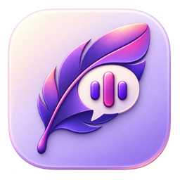
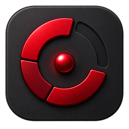
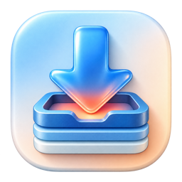

<h1 align="center">Hey, I’m Nolan.</h1>

  I build focused native macOS apps for the small annoyances that keep getting in the way.

  <strong>Swift · SwiftUI · WidgetKit · AppKit</strong> 
  Vancouver, BC

## Recent apps

<table>
  <tr>
    <td width="33%" valign="top">
      

        
      

      <h3 align="center">Parakeet Transcriber</h3>
      
Fast, private transcription with batch input, live progress, and on-device Parakeet, Nemotron, and Whisper models.

      
<a href="https://github.com/Italian-seasoning/ParakeetTranscriber"><strong>Explore the source →</strong></a>

    </td>
    <td width="33%" valign="top">
      

        
      

      <h3 align="center">Codex Usage Monitor</h3>
      
A native menu bar app and WidgetKit monitor for tokens, context, limits, cost estimates, streaks, and Headroom savings.

      
<a href="https://italian-seasoning.github.io/CodexUsageMonitor/"><strong>View the app →</strong></a>

    </td>
    <td width="33%" valign="top">
      

        
      

      <h3 align="center">Pullr</h3>
      
A native media download queue around yt-dlp, with Chrome handoff, Apple Music matching, and local diagnostics.

      
<a href="https://github.com/Italian-seasoning/Pullr/releases/latest"><strong>Get the preview →</strong></a>

    </td>
  </tr>
</table>

## How I build

- **Native** — SwiftUI first, AppKit when the native API is better.
- **Local-first** — private work stays on the Mac whenever the product allows it.
- **Focused** — one specific job, handled well, without turning into a platform.
